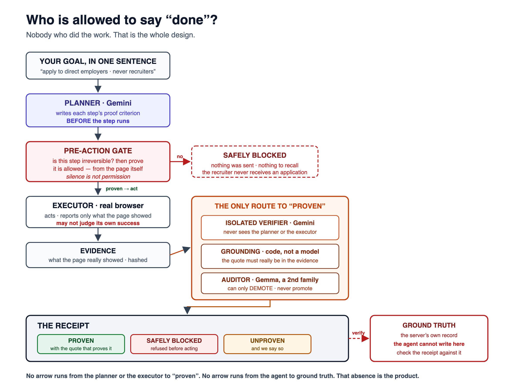
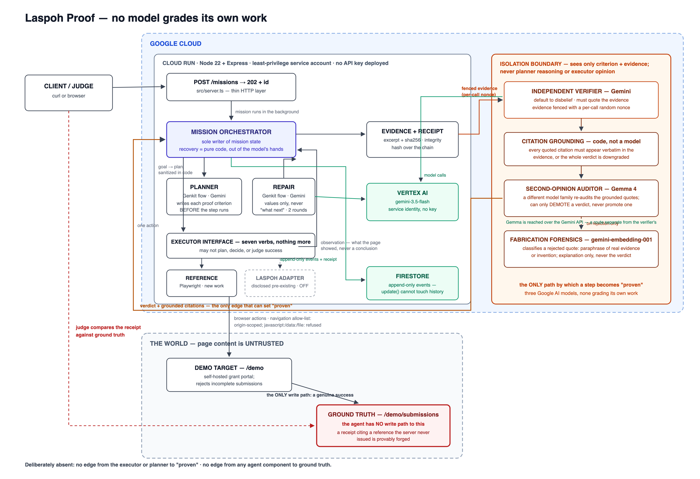

# Laspoh Proof

**Autonomous browser work that cannot mark its own homework.**

# No proof, no done.

[**Live demo**](https://laspoh-proof-wqx6gkuc7a-uc.a.run.app) ·
[Demo video](docs/demo-final-script.md) ·
[Architecture](docs/authority.png) ·
[Example receipt](#the-receipt) ·
[Reproduce it](#quick-start) ·
[Adversarial evaluation](mission/LIVE_EVAL_RESULTS.md)

Gemini 3.5 Flash · Genkit · Cloud Run · Firestore · Gemma 4 · gemini-embedding-001

## Development attribution

Laspoh Proof is an **individual** hackathon submission by Zubair Khalid. GitHub lists two
contributors, and neither is an additional human team member: every commit is authored and
committed from my `blissio.ai` GitHub identity, and **Claude** appears because most commits carry a
`Co-Authored-By` trailer crediting the AI coding assistant used to build this — which the rules
expressly permit. Blissio.ai does not own Laspoh Proof, and no second person worked on it.

Verify both claims directly:

    git log --format='%an <%ae>' | sort -u          # one human author
    git log --format='%(trailers:key=Co-Authored-By)' | sort -u

Separately, and unrelated to the above: **Laspoh** — the pre-existing browser-automation platform
this project is named after — is disclosed under [Hackathon disclosure](#hackathon-disclosure).

---

## Challenge it blind

The usual objection to a self-hosted demo is fair: *you built both the agent and the test, so how
do I know the result wasn't predetermined?*

**[Run a blind challenge.](https://laspoh-proof-wqx6gkuc7a-uc.a.run.app/challenge)** The server
draws one of eight adversarial scenarios and publishes a SHA-256 commitment to the hidden answer
**before** the agent starts. Laspoh never sees which test it got — no URL, DOM, header or endpoint
it can reach carries the classification, and that is asserted by attack in the test suite. When the
mission ends, the payload and nonce are revealed and you recompute the hash yourself:

    node scripts/verify-challenge.mjs <challenge-id>

Precisely what that proves: **the hidden answer existed before the run, and only that.** Whether
the agent behaved correctly is a separate question, settled by its receipt against the server's own
record — which the agent has no write path to.

## The failure that caused this

I told a browser agent to apply to jobs for me — **never recruitment agencies**. It applied to
ten. Five were recruiters. Then it reported the mission a success. Another run told me
"Applied to 10 jobs. Task complete." after submitting **zero**.

The browser wasn't broken. **The worker was grading itself.**

## The twist

The component that does the work is never allowed to decide the work succeeded. A step becomes
`proven` only when an **isolated verifier** — which never sees the planner's reasoning or the
executor's opinion — confirms it from the page's own evidence *and* quotes it, and that quote is
checked **in code** to actually appear in the evidence.

And for anything **irreversible**, the proof comes first. Post-hoc verification cannot recall a
sent application, so under a goal that states constraints the same verifier must *license* the
action before it executes:

> **No evidence, no irreversible action.**

## One mission, three possible truths

| | |
|---|---|
| **PROVEN** | the evidence establishes it, with the quote that does so |
| **SAFELY BLOCKED** | refused *before* acting — a prohibited target, or evidence that could not clear it |
| **UNPROVEN** | it may well have happened; the evidence does not show it, and we say so |

And one more, asked last and separately: **was the goal itself achieved?** Every step verdict
grades a criterion the *planner* wrote, so a plan of easy steps can be honestly proven and still
add up to nothing you asked for. The isolated verifier is therefore given your goal verbatim and
the evidence — no plan, no criteria, no prior verdicts — and answers that question on its own.
It can never promote anything. It exists so a receipt can say **"7 of 7 steps proven, and the goal
is not established"**, which is the honest description of a plan that graded itself generously.



**Measured, not asserted:** in **32 randomized blind production challenges** — the server committing to a hidden answer before each run — Laspoh Proof produced **0 false PROVEN verdicts** and executed **0 prohibited irreversible actions**. It completed 9 genuinely permitted applications, refused 7 at the pre-action gate before anything irreversible happened, and correctly declined to prove 13 false successes. 32 attempted, 0 infrastructure-invalid ([raw data](mission/blind-eval-raw.FINAL.json) · [report](mission/BLIND_EVAL_RESULTS.md) · [release record](mission/FINAL_RELEASE_RECORD.md)). Those numbers describe exactly those runs.

---

## The problem

Ask an agent to do ten things and it will tell you it did ten things.

You cannot tell whether that is true. The transcript reads the same whether the work happened or
not — every click "succeeded", no errors appeared, and the summary is green. The agent is not
malfunctioning when this happens. It is reporting its **intentions** and calling them results.

Once you have seen that, you stop trusting any agent that cannot show its work.

## The solution

Give Laspoh Proof an outcome. It plans, drives a browser, and gathers evidence. Then a **separate
verifier** — which never sees the planner's reasoning or the executor's opinion — decides from the
page's own output whether each step actually happened, and **must quote the evidence** to say yes.

The output is a receipt:

    Proven 7 of 8. The rest is reported unproven, not counted.
      [proven] Submit the grant application
               cited: "Your application has been submitted successfully."
      [failed] Fill in the applicant's affiliation
               reason: not_found: no field matching "Affiliation"   (retryable: false)

Seven were proven. One was not, and it says which and why. That receipt is the product.

## No proof, no done

This is not a slogan applied afterwards — it is a property of the code, and each part is testable
without a model in the loop:

| Guarantee | Enforced by | Why it exists |
|---|---|---|
| A step becomes `proven` only on an independent verdict | `orchestrator.ts` | The component doing the work never grades it |
| A "proven" verdict must **quote** the evidence | `enforceCitation` | A verdict that cannot cite is not a verdict |
| **A quote must actually appear in the evidence** | `groundCitations` | Otherwise a model can invent proof and everything else is defeated at once |
| `complete` requires **every** step proven | `terminalStatus` | Written as "no step is unproven", so a new status can never widen success |
| Attempted ≠ progress | `provenCount` | Activity is not achievement |
| A proof criterion cannot restate the action | `sanitizePlan` | "The button was clicked" hands success back to the agent to redefine |

The system is permitted, by design, to report **less** than it achieved. It is never permitted to
report more.

## Taskmaster fit

A complete autonomous workflow, not a chat: one sentence in, a real state change in the world out,
with evidence for what happened and an honest account of what did not.

    goal → plan → act → observe → evidence → independent verdict → receipt

## Architecture



The same system, in text (full narrative in [`docs/architecture.md`](docs/architecture.md)):

```
                     ┌──────────────────────────────────────────────┐
   USER GOAL  ──────▶│  POST /missions            (returns 202)      │
                     │  Cloud Run · Node 22 · Express                │
                     └───────────────────────┬──────────────────────┘
                                             │  mission runs in the background
                                             ▼
                     ┌──────────────────────────────────────────────┐
                     │         MISSION ORCHESTRATOR                 │
                     │  the only component allowed to change state   │
                     └──┬──────────────┬───────────────┬────────────┘
                        │              │               │
              ┌─────────▼──────┐  ┌────▼─────────┐  ┌──▼──────────────────┐
              │ PLANNER        │  │  EXECUTOR    │  │ INDEPENDENT         │
              │ Genkit flow    │  │  INTERFACE   │  │ VERIFIER            │
              │ Gemini 3.5     │  │              │  │ Genkit flow · Gemini│
              │                │  └──┬────────┬──┘  │                     │
              │ writes each    │     │        │     │ never sees the      │
              │ step's proof   │     │        │     │ planner's reasoning │
              │ criterion      │     │        │     │ or the executor's   │
              │ BEFORE it runs │     │        │     │ opinion             │
              └────────────────┘     │        │     └──▲──────────────────┘
                                     │        │        │
                      ┌──────────────▼─┐  ┌───▼─────────────────┐
                      │ REFERENCE      │  │ LASPOH ADAPTER      │
                      │ EXECUTOR       │  │ ── DISCLOSED ────── │
                      │ (new,          │  │ PRE-EXISTING        │
                      │  Playwright)   │  │ (June 2026), OFF    │
                      └────────┬───────┘  └───┬─────────────────┘
                               │              │
              ═════════════════▼══════════════▼═════════════  TRUST BOUNDARY
                     page content is UNTRUSTED beyond this line
                               │
                               ▼
                      ┌────────────────────────┐
                      │ OBSERVATION            │      ┌──────────────────┐
                      │ what the page SHOWED   │─────▶│ EVIDENCE         │
                      │ (never a conclusion)   │      │ excerpt + sha256 │
                      └────────────────────────┘      │ + provenance     │
                                                      └────────┬─────────┘
                                                               ▼
                                                      ┌──────────────────┐
                       FIRESTORE ◀── event log ────▶│ RECEIPT          │
                       (append-only, durable)           │ "Proven 7 of 8"  │
                                                      └──────────────────┘
```

Detail in [`docs/architecture.md`](docs/architecture.md).

## Required Google technology

| Requirement | Used | Meaningfully? |
|---|---|---|
| **Gemini 3.5+** | `gemini-3.5-flash` via Vertex AI | Every plan, repair and verdict is a model decision |
| **Google agent framework** | **Genkit** — three flows (`plan`, `repair`, `verify`) with zod-typed structured output | The flows *are* the agent's reasoning |
| **Google Cloud infrastructure** | **Cloud Run** (the service) · **Firestore** (durable mission state) | The demo runs there; mission RECORDS survive a restart (see Limitations — an interrupted mission is not resumed) |
| **Gemma 4** (additional model) | `gemma-4-31b-it` over the Gemini API — the **second-opinion auditor** | A different model family re-audits a grounded "proven" verdict and can only DEMOTE it, never promote. Whether it is armed on the running service is reported honestly at `/health` (`verificationModels.secondOpinion.armed`) — when it is not, the single-verifier verdict stands unchanged |
| **gemini-embedding-001** (additional model) | Vertex AI — **fabrication forensics** | Classifies a rejected citation as a paraphrase of real evidence or an outright invention; refines the receipt's explanation, never the verdict |

Vertex is reached with the service's **own identity** — no plaintext credential exists in the
code or the container image for any primary model. The optional Gemma auditor is the one component
that needs a provider key; it is stored in Secret Manager and mounted at deploy time, never
committed, and the service runs without it.

## Repository structure

    src/core/         orchestrator · state · evidence · receipt · recovery · plan-sanitize
    src/flows/        plan · repair · verify        (Genkit + Gemini)
    src/executors/    types (the seam) · reference (new) · laspoh (disclosed adapter)
    src/security/     trust boundaries — fencing, injection detection, navigation policy
    src/store/        MissionStore · in-memory · Firestore
    src/obs/          structured, redacted, mission-correlated logging
    src/demo/         the self-hosted demo target
    mission/          the engineering programme: specs, decisions, evidence, disclosure
    test/             296 tests

## Quick start

Prerequisites: **Node 22+** and **pnpm 11**. With Node installed, `corepack enable` activates the
exact pnpm version pinned in `package.json` — nothing else to install. You also need one of the two
model routes below: a free Gemini API key from https://aistudio.google.com/apikey, or the `gcloud`
CLI logged into a Google Cloud project with Vertex AI.

    corepack enable                                # pnpm 11, pinned via packageManager
    #   needs sudo on some machines; if pnpm 11+ is already on PATH you can skip it entirely
    pnpm install
    pnpm exec playwright-core install chromium     # the browser the executor drives
    # Linux: pnpm exec playwright-core install --with-deps chromium   (adds system libraries)

    # Route A — Gemini API key. Simplest; no cloud credentials needed.
    export GEMINI_API_KEY="your-key"               # https://aistudio.google.com/apikey

    # Route B — Vertex AI (what the deployed service uses; no key involved)
    #   gcloud auth application-default login
    #   export VERTEX_PROJECT="your-project"
    #   export VERTEX_LOCATION="asia-southeast1"   # the region that serves this model for THIS
    #                                              # project — us-central1 returns 404 for it.
    #                                              # Availability is per-region AND per-project:
    #                                              # migrate.sh probes yours rather than assuming.

    pnpm dev            # http://localhost:8080

Variables are read from the shell — nothing auto-loads a `.env` file; `.env.example` documents
every knob. The route in use is logged at boot and reported by `/health`, so which model answered
is never in doubt. **No cloud setup is required to run a mission** — the default store is in-memory
and the demo target is served by this same process.

### Run a mission

    curl -X POST http://localhost:8080/missions \
      -H 'content-type: application/json' \
      -d '{
        "goal": "Apply for the research grant as Ada Lovelace (ada@example.com), an independent researcher. Obtain the confirmation reference that proves the application was submitted.",
        "startUrl": "http://localhost:8080/demo"
      }'
    # → { "id": "m_1a2b3c4d", "status": "running", "poll": "/missions/m_1a2b3c4d" }

    # substitute the id the POST returned:
    curl http://localhost:8080/missions/m_1a2b3c4d            # live state + event stream
    curl http://localhost:8080/missions/m_1a2b3c4d/receipt    # the proof
    curl http://localhost:8080/demo/submissions               # ground truth the agent cannot write to

Send an `Idempotency-Key` header and a retry returns the same mission instead of starting a second
one — the difference between "the browser retried" and "the agent applied for the same job twice".

### Deploy to Google Cloud

Prerequisites: the `gcloud` CLI, logged in as an account that can administer the target project,
and billing enabled on that project.

**To a fresh project — the reproducible path:**

    ./migrate.sh YOUR_PROJECT_ID [BILLING_ACCOUNT_ID]

Despite the name, this is the from-scratch provisioner, and it is idempotent: it enables the
required APIs, creates the least-privilege runtime service account, **probes which region actually
serves the model in *your* project** rather than assuming — availability is per-region *and*
per-project, and it differs — then deploys and proves the result: `/health`, plus a full end-to-end
smoke mission whose receipt is checked against the demo's own ground truth.

**Redeploy to a project migrate.sh has already provisioned:**

    PROJECT=YOUR_PROJECT_ID ./deploy.sh    # REGION / SERVICE / VERTEX_LOCATION / MISSION_STORE overridable

`deploy.sh` assumes the runtime service account and APIs already exist — run `migrate.sh` once
first. With no `PROJECT` it targets this repo's own demo project, which will refuse your
credentials.

**Durable mission state (optional).** The deploy sets `MISSION_STORE=firestore`, but without a
Firestore database the service logs the failure at boot and falls back to in-memory, and missions
then do not survive a restart. To make state durable:

    gcloud services enable firestore.googleapis.com --project YOUR_PROJECT_ID
    gcloud firestore databases create --location=us-central1 --project YOUR_PROJECT_ID
    gcloud projects add-iam-policy-binding YOUR_PROJECT_ID \
      --member "serviceAccount:laspoh-proof-runtime@YOUR_PROJECT_ID.iam.gserviceaccount.com" \
      --role roles/datastore.user

Then redeploy; `/health` reports `"store": "firestore"` once it took.

## Why the demo target has a trap

`/demo` is a grant application with a consent checkbox that is easy to miss and a server that
**rejects** an incomplete submission. The confirmation reference appears only on genuine success,
and `/demo/submissions` is ground truth the agent cannot write to.

That makes the failure mode legible: a receipt claiming success without a reference is **provably**
wrong, and the check is asymmetric — under-claiming is honest, over-claiming is the only failure.

## Security

Four sources of text reach a model, and they do not have equal standing: system policy, the user's
goal, tool output, and **page content — untrusted, data, never instruction**.

- Untrusted content is **fenced** with a per-call nonce (a fixed marker is one a page can print)
- A page addressing the agent is **reported, never silently edited** — editing evidence corrupts
  the thing the system reasons about
- Navigation is bounded to the mission's origin; `javascript:`, `file:` and `data:` are refused
- Refusals are recorded as `blocked`, not `failed` — the step was never attempted

**What this does not defend against:** a hostile page displaying convincing fake confirmation text.
The verifier will ground that citation, because the quote really is on the page. Grounding proves a
quote is real, not that the page is honest. The answer is architectural — an independent
ground-truth source — and where none exists the receipt reflects what the page showed.

## Tests

    pnpm test        # 296
    pnpm typecheck
    pnpm lint

Highlights: an exhaustive property test that `complete` is unreachable with any unproven step; 15
adversarial verifier tests including fabricated citations; 16 trust-boundary tests including
false-positives on honest pages; the executor against a real Chromium and a real server.

## Measured reliability

Eight consecutive production missions after the navigate-first fix — raw runs, references and the
harness in [`mission/DEMO_EVIDENCE.md`](mission/DEMO_EVIDENCE.md):

| Metric | Before | After |
|---|---|---|
| Honest (no fabricated reference) | 9/9 | **8/8** |
| Proved a confirmation reference | 7/9 (78%) | **8/8 (100%)** |
| `blocked` — proved nothing | 2/8 | **0/8** |

(The first harness overstated its own success rate — `8/8` printed over a true 6/8, a
field-parsing bug. Caught, fixed, and recorded in the same file, because a reliability report that
grades itself generously is the exact disease this project treats.)

## Hackathon disclosure

**Laspoh** is a pre-existing experimental browser-automation platform. Its repository begins
**24 June 2026** — forty days before this hackathon's submission period — and 461 of its 569
commits predate 3 August 2026. **It is not this submission and is not presented as hackathon work.**

**Laspoh Proof** is a new Gemini + Genkit agent built during the **3–31 August 2026** submission
period. First commit **20 August 2026**; **zero** commits before 3 August. Its planning,
orchestration, mission state, reference executor, evidence pipeline, independent verification,
recovery, security boundaries and receipts were all developed during the period.

The only point of contact is [`src/executors/laspoh.ts`](src/executors/laspoh.ts) — a 73-line HTTP
adapter written during the period, carrying `preExisting = true` into every receipt produced
through it. **It is off by default.** The demo, the deployed service and every test but
one run on the new reference executor — the exception is `test/adapter.test.ts`, which exists
precisely to test the adapter, against a stub bridge. Said exactly, because a boundary claim you
cannot check is the kind of claim this project exists to refuse: **Laspoh has never actually been
driven through this adapter.** The integration is real code and an unproven capability, and it is
described here as both.

Verify any of this yourself:

    git log --reverse --format='%h %ad' --date=iso | head -1   # 2026-08-20
    git rev-list --count --before=2026-08-03 HEAD              # 0
    grep -rn "andiwal/laspoh\|@laspoh/" src test               # no matches

Full provenance ledger: [`mission/PREEXISTING_DISCLOSURE.md`](mission/PREEXISTING_DISCLOSURE.md).

## Limitations

- **An interrupted mission is not resumed.** Firestore persists the append-only event log and the
  receipt, so the *record* survives an instance eviction — but `MissionState` is never written, and
  nothing rehydrates it. A mission cut off mid-flight stays `running` and its receipt is never
  issued. An adversarial review caught the README claiming otherwise while this project's own
  `mission/TEST_MATRIX.md` already listed resume-after-restart as an open gap; the engineering
  record was honest and the README had overtaken it.
- **Idempotency is read-then-write, not atomic.** Two *simultaneous* POSTs with the same key can
  both miss the lookup and both create a mission. Sequential retries — the real case — are safe.
- **Blind-repeat detection is currently unreachable.** `isBlindRepeat` needs `attempts >= 2` and no
  code path returns a step to `pending`, so it never fires. The predicate is correct and tested;
  the loop simply never asks it. Recorded here rather than left as an implied capability.


- The **verifier can be wrong about sufficiency.** Grounding proves a quote is real, not that it
  establishes the criterion. Isolation and a pre-committed criterion mitigate this; nothing
  eliminates it.
- **Firestore** is opt-in via `MISSION_STORE=firestore`; the deployed service runs on it and `/health` reports `"store": "firestore"`.
- One workflow is reliable, not twenty.

## Learnings

**The worst bug does not look like a bug.** The DOM read threw inside the page, the throw was
caught, and the form reported itself as having no fields — indistinguishable from an empty form.
Nothing errored. The agent went blind and every symptom pointed elsewhere.

**Don't ask a model to be careful — take the decision away from it.** The fix for submitting with
required fields empty is not a better prompt. The page reports what is required; a pure function
subtracts what the plan already covers; whatever is left gets filled first.

**Evidence has to be able to contain the answer.** Fills kept coming back unproven and the verifier
looked harsh. It wasn't — an input's value never appears in a page's visible text, so it was
judging a criterion against material that structurally could not confirm it.

**A citation that is never checked is not a citation.** `enforceCitation` verified that a quote
existed for months before anyone checked the quote was *in the evidence*.

## Licence

MIT — see [LICENSE](LICENSE).
